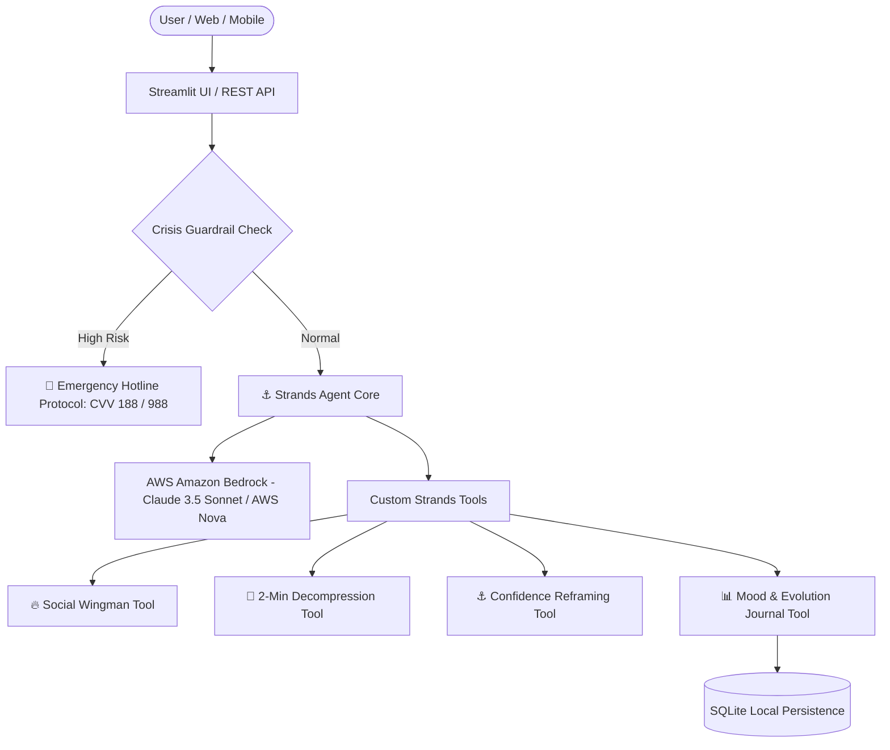

# ⚓ Ancora AI — Autonomous Life Anchor & Social Wingman Copilot

> **Agents for Humans Hackathon** (in partnership with AWS)  
> **Track:** Everyday Agents  
> **Repository:** [janlucascc/ancora-ai](https://github.com/janlucascc/ancora-ai)

---

## 🌟 Overview
**Ancora AI** (inspired by the Latin *Ancora* — Anchor & Safe Harbor) is a 24/7 autonomous everyday AI companion built with the **Strands Agents SDK** and **Amazon Bedrock**.

It is designed for real-world daily challenges:
1. **Workplace & Career Decompression:** Instant resets after stressful meetings, overcoming imposter syndrome, and boundary management.
2. **Dating & Social Wingman:** Practical conversation openers, flirting dynamics, text crafting, and overcoming social anxiety.
3. **Everyday Emotional Grounding:** Science-backed 2-minute micro-routines (Box Breathing, 5-4-3-2-1 Grounding).
4. **Safety & Crisis Guardrails:** Automatic detection and referral to emergency hotlines (CVV 188 / 988).

---

## 🏛️ Architecture



---

## 🛠️ Built With
- **Agent Framework:** `strands-agents` (Strands Agents SDK)
- **Cloud & AI Foundation:** AWS Amazon Bedrock (Anthropic Claude 3.5 Sonnet / AWS Nova)
- **Language:** Python 3.10+
- **Frontend / UI:** Streamlit
- **Persistence:** SQLite
- **Observability:** OpenTelemetry ready

---

## 🚀 Getting Started

### 1. Clone the repository
```bash
git clone https://github.com/janlucascc/ancora-ai.git
cd ancora-ai
```

### 2. Create virtual environment & install dependencies
```bash
python -m venv venv
# Windows:
venv\Scripts\activate
# Mac/Linux:
source venv/bin/activate

pip install -r requirements.txt
```

### 3. Setup Environment Variables
Copy `.env.example` to `.env` and fill in your AWS credentials:
```bash
cp .env.example .env
```

### 4. Run the Application
```bash
streamlit run src/ui/app.py
```

### 5. Run Automated Tests
```bash
pytest tests/test_agent.py
```

---

## 👥 Authors
- **Jan Lucas** ([@janlucascc](https://github.com/janlucascc))
