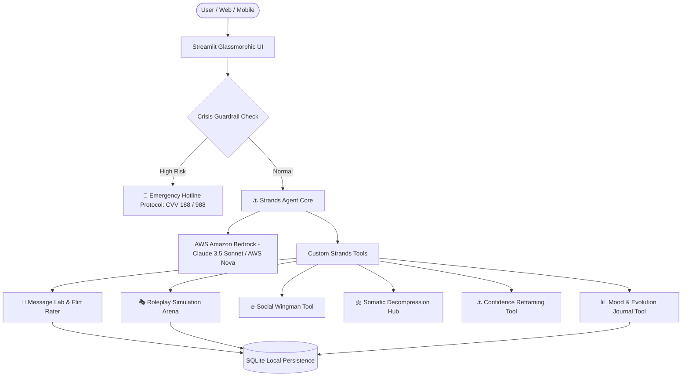

# ⚓ Ancora AI — Autonomous Life Anchor & Social Wingman Copilot

> **Agents for Humans Hackathon** (in partnership with AWS)  
> **Track:** Everyday Agents  
> **Repository:** [janlucascc/ancora-ai](https://github.com/janlucascc/ancora-ai)

---

## 🌟 Overview
**Ancora AI** (inspired by the Latin *Ancora* — Anchor & Safe Harbor) is a 24/7 autonomous everyday AI companion built with the **Strands Agents SDK** and **Amazon Bedrock**.

It solves real-world everyday human challenges:
1. **💼 Workplace & Career Decompression:** Instant resets after stressful meetings, overcoming imposter syndrome, and boundary management.
2. **📱 Message Lab & Flirt Rater:** Real-time analysis of drafted texts (Confidence Score, Neediness Index, Banter Level) with 3 AI-tailored high-value rewrites.
3. **🎭 Scenario Roleplay Arena:** Turn-based live simulator to practice tough boss negotiations, first date icebreakers, and social networking with automated AI scorecards.
4. **🫁 Visual Somatic Grounding:** CSS-animated Box Breathing circle + Dr. Andrew Huberman's *Physiological Sigh* + built-in relaxing soundscapes (Rain, Ocean, Hearth).
5. **📈 Emotional Evolution Dashboard:** Interactive charts tracking mood trends and emotional frequency over time.
6. **🛡️ Safety & Crisis Guardrails:** Automatic detection and compassionate referral to emergency hotlines (CVV 188 / 988).

---

## 🏛️ System Architecture



---

## 🛠️ Built With
- **Agent Framework:** `strands-agents` (Strands Agents SDK)
- **Cloud & AI Foundation:** AWS Amazon Bedrock (Anthropic Claude 3.5 Sonnet / AWS Nova)
- **Language:** Python 3.10+
- **Frontend / UI:** Streamlit with Custom Glassmorphism, CSS Keyframe Animations & Audio Embeds
- **Persistence:** SQLite
- **Observability:** OpenTelemetry ready

---

## 🚀 Getting Started

### 1. Clone the repository
```bash
git clone https://github.com/janlucascc/ancora-ai.git
cd ancora-ai
```

### 2. Create virtual environment & install dependencies
```bash
python -m venv venv
# Windows:
venv\Scripts\activate
# Mac/Linux:
source venv/bin/activate

pip install -r requirements.txt
```

### 3. Setup Environment Variables
Copy `.env.example` to `.env` and fill in your AWS credentials:
```bash
cp .env.example .env
```

### 4. Run the Application
```bash
streamlit run src/ui/app.py
```

### 5. Run Automated Tests
```bash
python tests/test_agent.py
```

---

## 👥 Authors
- **Jan Lucas** ([@janlucascc](https://github.com/janlucascc))
